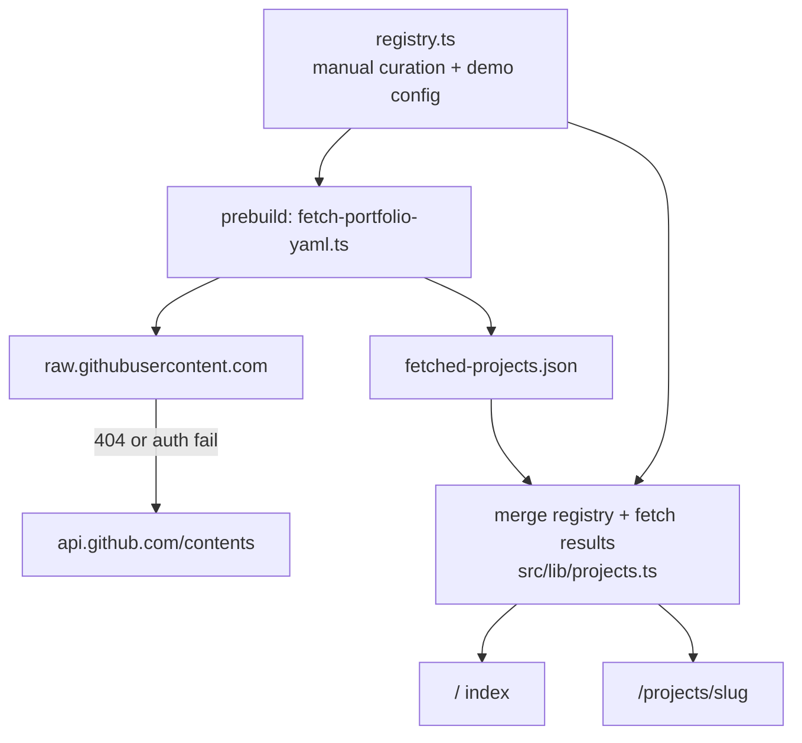
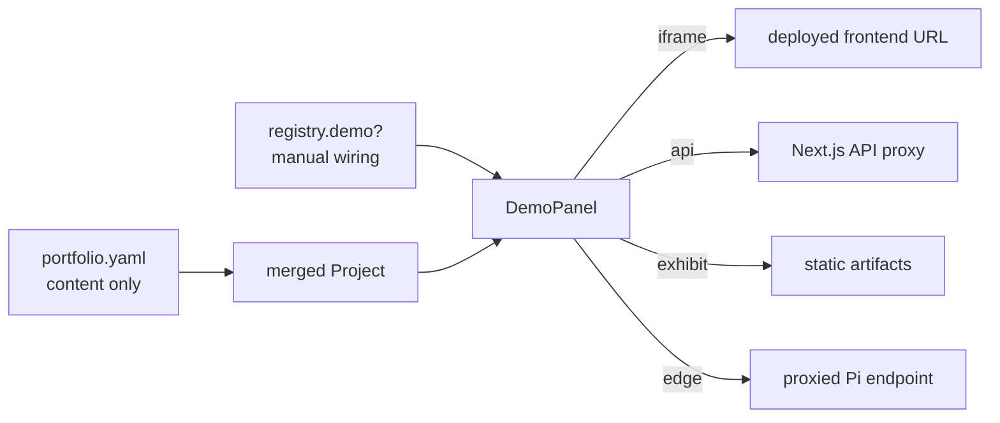

# Architecture

## Overview

The portfolio merges two sources at build time:

1. **Portfolio registry** (`src/data/registry.ts`) — manual curation: which repos appear, slug overrides, branch overrides, demo wiring.
2. **Project YAML** (`portfolio.yaml` in each repo) — narrative content: title, summary, description, stack, status, links.

The registry always wins for embedded demo configuration. YAML `links.demo` is an optional external URL fallback when no registry demo is wired.

## Data flow



### Build-time fetch

For each entry in `registry`, `scripts/fetch-portfolio-yaml.ts` runs before `next build` (via `prebuild`):

1. **Public repos:** `GET https://raw.githubusercontent.com/{owner}/{repo}/{branch}/portfolio.yaml`
2. **Private repos or raw 404/401/403:** `GET https://api.github.com/repos/{owner}/{repo}/contents/portfolio.yaml?ref={branch}` with `Authorization: Bearer ${GITHUB_TOKEN}`

Parse YAML, validate against [contract.md](./contract.md), write results to `src/lib/fetched-projects.json`.

**Per-repo error handling** — build continues even when individual repos fail:

| Status | Meaning |
|--------|---------|
| `ok` | Valid portfolio.yaml fetched |
| `missing_yaml` | File not found (expected for repos without yaml yet) |
| `invalid_yaml` | Parse or validation failure |
| `fetch_error` | Network or auth error |

**Dev fallback:** set `PORTFOLIO_FETCH_SKIP=true` to skip fetch and use `src/lib/mock-projects.ts` instead.

### Environment variables

| Variable | Required | Purpose |
|----------|----------|---------|
| `GITHUB_TOKEN` | For private repos | GitHub API access during fetch |
| `PORTFOLIO_FETCH_SKIP` | No | Skip fetch; use mock data (dev only) |

Copy [`.env.example`](../.env.example) to `.env.local` for local development. On Vercel, add `GITHUB_TOKEN` in project environment variables (Production + Preview). Never expose the token in client code.

## Demo wiring flow

Demos are **never** auto-wired from YAML alone. A project appears on the index without a demo; the demo column shows `—` until manually configured.



Demo wiring is independent of yaml fetch status — iframe demos work even when `contentStatus !== "ok"`.

### Demo types

| Type | Use case | Client exposure |
|------|----------|-----------------|
| `iframe` | Deployed frontend (e.g. Background Studio) | Public URL only |
| `api` | Interactive API playground (e.g. PII Gateway) | Proxy path only; keys server-side |
| `exhibit` | Static artifacts (e.g. GSTF metrics, Grad-CAM images) | Public asset path |
| `edge` | Proxied edge device (e.g. ADA Pi status) | Proxy path only; device URL server-side |

## Build and revalidation

```typescript
// src/app/projects/[slug]/page.tsx
export const revalidate = 3600; // 1 hour ISR
```

- Project pages regenerate at most once per hour when visited.
- Index page can use the same revalidation or be fully static depending on fetch strategy.
- `generateStaticParams()` pre-builds all known slugs from the registry.
- `prebuild` runs `npm run fetch:projects` on every production build.

### Optional deploy hook (Phase 3)

A GitHub Action in each project repo can POST to a Vercel deploy hook when `portfolio.yaml` changes, triggering immediate rebuild without waiting for ISR.

## Security

- **Never** put API keys, Pi URLs, or private endpoints in client bundles.
- **Never** commit `GITHUB_TOKEN` — use `.env.local` locally and Vercel env vars in production.
- `api` and `edge` demo types use Next.js API route proxies (`src/app/api/...`).
- Proxy routes validate input, rate-limit, and attach credentials server-side only.
- YAML `links.demo` external URLs are plain `<a>` links, not embedded unless registry wires an iframe.

## Folder structure

```
aryan-portfolio/
├── docs/                          # Source of truth (you are here)
├── scripts/
│   └── fetch-portfolio-yaml.ts    # Build-time GitHub fetch
├── public/
│   └── resume.pdf                 # Expected location; add manually
├── src/
│   ├── app/
│   │   ├── layout.tsx             # Root shell: font, header, footer
│   │   ├── globals.css            # Design tokens, header accent texture
│   │   ├── page.tsx               # Index table
│   │   ├── about/page.tsx
│   │   └── projects/[slug]/page.tsx
│   ├── components/
│   │   ├── SiteHeader.tsx
│   │   ├── SiteFooter.tsx
│   │   ├── ProjectTable.tsx
│   │   ├── ProjectSplit.tsx
│   │   └── DemoPanel.tsx
│   ├── data/
│   │   └── registry.ts            # Curated project list + demo config
│   └── lib/
│       ├── portfolio-schema.ts    # YAML types + validation
│       ├── projects.ts            # Types, merge helper, getters
│       ├── fetched-projects.json  # Build output from fetch script
│       └── mock-projects.ts       # Dev fallback when fetch skipped
└── package.json                   # Next.js + React + Tailwind + TS + yaml
```

## Dependencies

Runtime stack:

- `next`, `react`, `react-dom`
- `yaml` (portfolio.yaml parsing at build time)
- `tailwindcss` (dev)
- `tsx` (dev — runs fetch script)
- IBM Plex Mono via `next/font/google` (no npm package)

**Explicitly excluded from the portfolio shell:** Three.js, React Three Fiber, GSAP, Lenis, animation libraries, scroll hijacking.

## Phase roadmap

| Phase | Scope |
|-------|-------|
| 1 (done) | Static shell, mock data, docs, placeholder demo panel |
| 2 (partial) | GitHub YAML fetch at build time, content status UI, iframe demos live |
| 3 | Deploy hooks, exhibit assets, edge proxy for ADA, API proxies |
