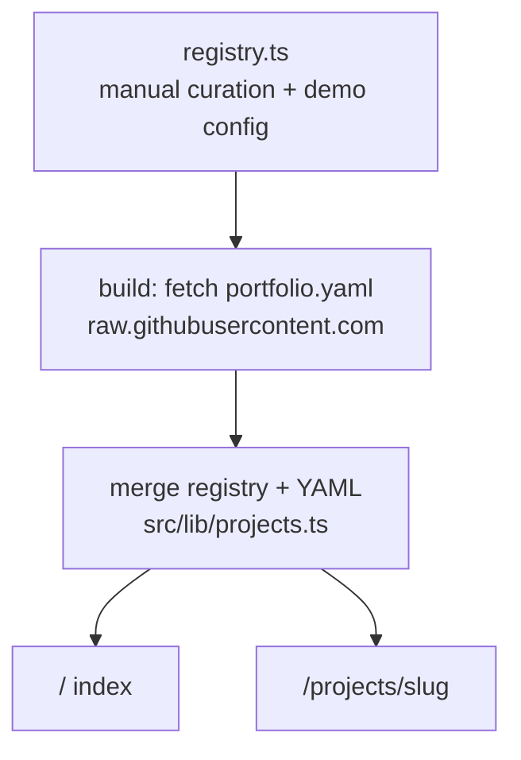
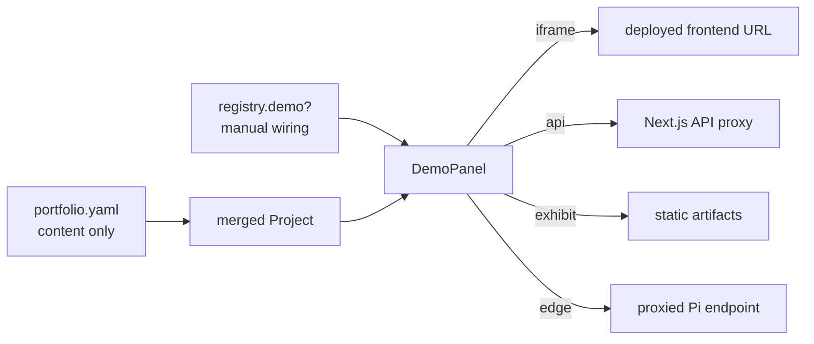

# Architecture

## Overview

The portfolio merges two sources at build time:

1. **Portfolio registry** (`src/data/registry.ts`) — manual curation: which repos appear, slug overrides, demo wiring.
2. **Project YAML** (`portfolio.yaml` in each repo) — narrative content: title, summary, description, stack, status, links.

The registry always wins for embedded demo configuration. YAML `links.demo` is an optional external URL fallback when no registry demo is wired.

## Data flow



### Build-time fetch (Phase 2)

For each entry in `registry`:

```
GET https://raw.githubusercontent.com/{owner}/{repo}/main/portfolio.yaml
```

Parse YAML, validate against [contract.md](./contract.md), merge with registry entry via `mergeProject()`.

**Current scaffold:** uses `src/lib/mock-projects.ts` instead of live fetch.

## Demo wiring flow

Demos are **never** auto-wired from YAML alone. A project appears on the index without a demo; the demo column shows `—` until manually configured.



### Demo types

| Type | Use case | Client exposure |
|------|----------|-----------------|
| `iframe` | Deployed frontend (e.g. Background Studio) | Public URL only |
| `api` | Interactive API playground (e.g. PII Gateway) | Proxy path only; keys server-side |
| `exhibit` | Static artifacts (e.g. GSTF metrics, Grad-CAM images) | Public asset path |
| `edge` | Proxied edge device (e.g. ADA Pi status) | Proxy path only; device URL server-side |

## Build and revalidation

```typescript
// src/app/projects/[slug]/page.tsx
export const revalidate = 3600; // 1 hour ISR
```

- Project pages regenerate at most once per hour when visited.
- Index page can use the same revalidation or be fully static depending on fetch strategy.
- `generateStaticParams()` pre-builds all known slugs from the registry.

### Optional deploy hook (Phase 3)

A GitHub Action in each project repo can POST to a Vercel deploy hook when `portfolio.yaml` changes, triggering immediate rebuild without waiting for ISR.

## Security

- **Never** put API keys, Pi URLs, or private endpoints in client bundles.
- `api` and `edge` demo types use Next.js API route proxies (`src/app/api/...`).
- Proxy routes validate input, rate-limit, and attach credentials server-side only.
- YAML `links.demo` external URLs are plain `<a>` links, not embedded unless registry wires an iframe.

## Folder structure

```
aryan-portfolio/
├── docs/                          # Source of truth (you are here)
├── public/
│   └── resume.pdf                 # Expected location; add manually
├── src/
│   ├── app/
│   │   ├── layout.tsx             # Root shell: font, header, footer
│   │   ├── globals.css            # Design tokens, header accent texture
│   │   ├── page.tsx               # Index table
│   │   ├── about/page.tsx
│   │   └── projects/[slug]/page.tsx
│   ├── components/
│   │   ├── SiteHeader.tsx
│   │   ├── SiteFooter.tsx
│   │   ├── ProjectTable.tsx
│   │   ├── ProjectSplit.tsx
│   │   └── DemoPanel.tsx
│   ├── data/
│   │   └── registry.ts            # Curated project list + demo config
│   └── lib/
│       ├── projects.ts            # Types, merge helper, getters
│       └── mock-projects.ts       # Static YAML-shaped data (scaffold only)
└── package.json                   # Next.js + React + Tailwind + TS only
```

## Dependencies

Minimal runtime stack:

- `next`, `react`, `react-dom`
- `tailwindcss` (dev)
- IBM Plex Mono via `next/font/google` (no npm package)

**Explicitly excluded from the portfolio shell:** Three.js, React Three Fiber, GSAP, Lenis, animation libraries, scroll hijacking.

## Phase roadmap

| Phase | Scope |
|-------|-------|
| 1 (current) | Static shell, mock data, docs, placeholder demo panel |
| 2 | GitHub YAML fetch at build time, first live demos, API proxies |
| 3 | Deploy hooks, exhibit assets, edge proxy for ADA |
